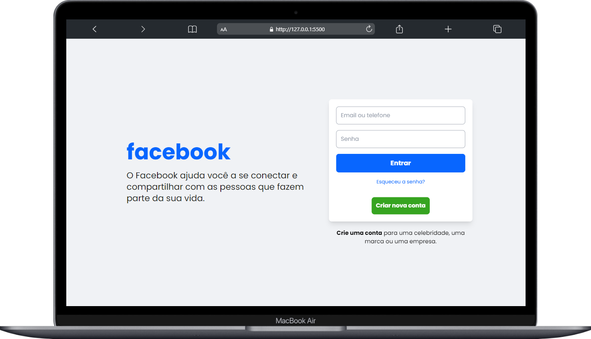
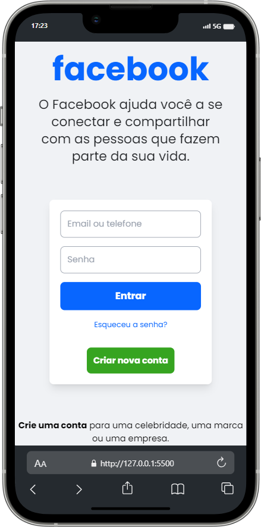

# Clone da Página de Login do Facebook 🎨

Este é um clone da página de login do Facebook desenvolvido usando apenas HTML e Tailwind CSS.

## Tecnologias Utilizadas ⚙️

- HTML
- Tailwindcss

## URL do projeto 🌐

Confira o projeto Confira o projeto <a href="https://raphaeleliass.github.io/Facebook-LoginScreen/" target="_blank">clicando aqui</a>.

## Capturas de Tela 📸

  

  

## Contribuição 🤝

Contribuições são bem-vindas! Sinta-se à vontade para abrir issues ou enviar solicitações de pull.

## Licença ⚖️

Este projeto está licenciado sob a [MIT License](LICENSE).

## Contato ✉️

Entre em contato comigo pelo email: raphaeleliass@outlook.com.
